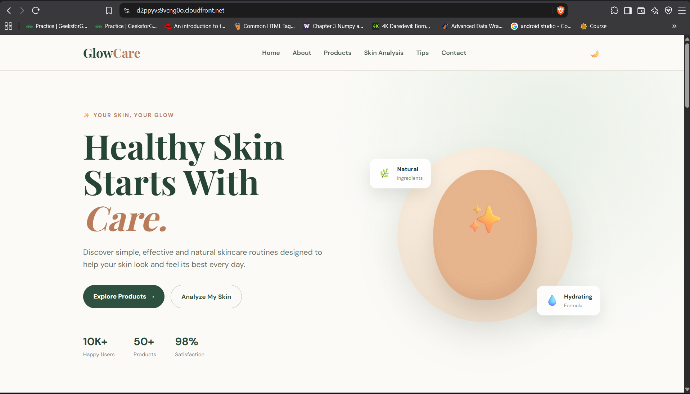
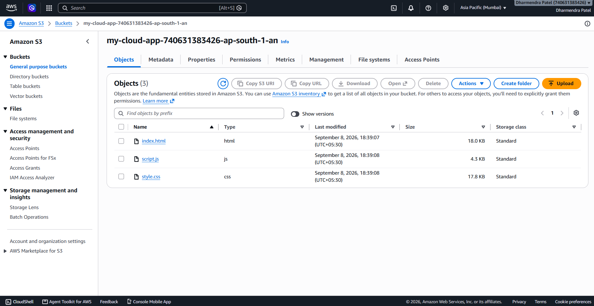
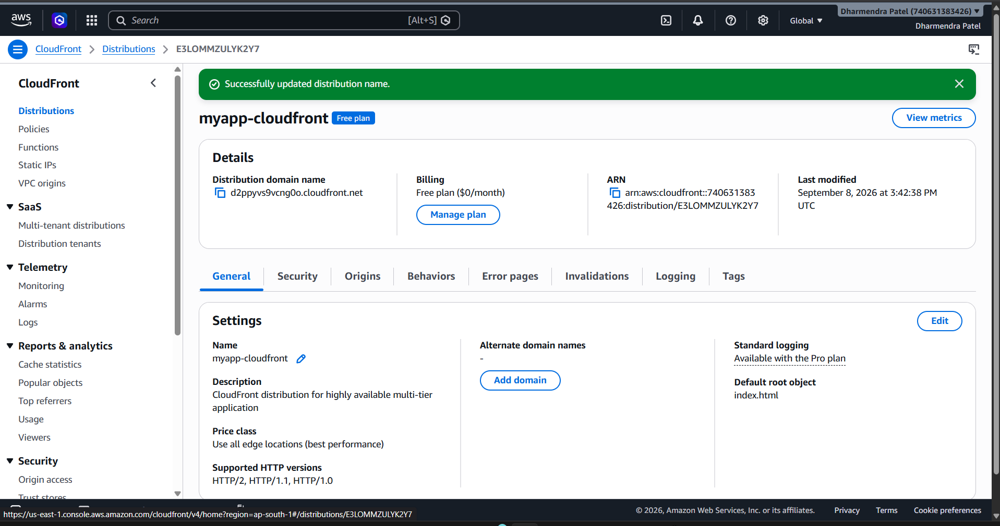

# 🌿 GlowCare - Skin Care Website

A modern, responsive and user-friendly **Skin Care Website** built using HTML, CSS and JavaScript.

The website provides information about skincare, skincare products, skin analysis, skincare tips and personalized skin-care guidance.

The website is deployed on **Amazon S3** as a static website and delivered globally using **Amazon CloudFront**.

---

## 🌐 Live Website

🚀 **Visit GlowCare:**

https://d2ppyvs9vcng0o.cloudfront.net/

---

## 📌 Project Overview

GlowCare is a frontend-based skincare website designed to provide users with a simple and attractive platform for exploring skincare products and learning about healthy skin-care practices.

The project focuses on:

- Clean and modern UI
- Responsive design
- Skincare product showcase
- Skin type analysis
- Skincare tips
- Interactive JavaScript features
- AWS cloud deployment
- Global content delivery using Amazon CloudFront

---

## ✨ Features

### 🏠 Home Section

The home page introduces GlowCare and provides users with quick access to the main features of the website.

### 🌿 About GlowCare

Provides information about the purpose and philosophy behind the GlowCare skincare platform.

### 🧴 Skincare Products

Displays different skincare products such as:

- Face Cleanser
- Hydrating Serum
- Moisturizer
- Sunscreen

Users can interact with the product buttons to receive notifications.

### 🔬 Skin Analysis

The website includes an interactive skin-type quiz.

Users can select:

- Dry Skin
- Oily Skin
- Combination Skin
- Normal Skin

The website provides basic skincare guidance based on the selected skin type.

### 💡 Skincare Tips

Provides simple skincare recommendations such as:

- Gentle cleansing
- Staying hydrated
- Using sunscreen
- Maintaining a regular skincare routine

### 🌙 Dark Mode

Users can switch between light mode and dark mode using the theme button.

The selected theme is stored using browser Local Storage.

### 📱 Responsive Design

The website is responsive and works on:

- Desktop
- Laptop
- Tablet
- Mobile devices

### 📩 Newsletter

Users can enter their email address to subscribe to skincare updates.

---

# 🛠️ Technologies Used

| Technology | Purpose |
|------------|---------|
| HTML5 | Website structure |
| CSS3 | Styling and responsive design |
| JavaScript | Interactivity and functionality |
| Google Fonts | Typography |
| Amazon S3 | Static website hosting |
| Amazon CloudFront | CDN and global content delivery |

---

# ☁️ AWS Deployment

The GlowCare website is deployed using AWS cloud services.

### AWS Services Used

#### Amazon S3

Amazon S3 is used to store the static website files.

The following files are uploaded to the S3 bucket:

```text
index.html
style.css
script.js
```

S3 provides the storage and static website hosting for the frontend files.

---

#### Amazon CloudFront

Amazon CloudFront is used as the Content Delivery Network (CDN) for the website.

CloudFront connects to the S3 origin and delivers the website content to users through AWS edge locations.

This provides:

- Faster content delivery
- Global availability
- CDN-based caching
- Improved website performance
- Secure HTTPS access

---

# 🏗️ AWS Architecture

The deployment architecture of GlowCare is:

```text
                    👤 User
                       |
                       |
                       ▼
              ☁️ Amazon CloudFront
                       |
                       |
                       ▼
                  🪣 Amazon S3
                       |
              ┌────────┼────────┐
              |        |        |
              ▼        ▼        ▼
          index.html style.css script.js
```

### Deployment Flow

```text
User
  ↓
CloudFront Distribution
  ↓
S3 Bucket
  ↓
Static Website Files
  ↓
GlowCare Website
```

---

# 📂 Project Structure

```text
glowcare-website/
│
├── screenshots/
│   ├── home-page.png
│   ├── aws-s3.png
│   └── cloudfront.png
│
├── .gitignore
├── README.md
├── index.html
├── style.css
└── script.js
```

---

# 📸 Screenshots

## 🏠 GlowCare Home Page



The home page contains the GlowCare branding, navigation bar, skincare introduction, product section and skin analysis option.

---

## ☁️ Amazon S3 Deployment



The website's static files are stored inside an Amazon S3 bucket.

The bucket contains:

```text
index.html
script.js
style.css
```

---

## 🚀 Amazon CloudFront Deployment



Amazon CloudFront is configured with the S3 bucket as the origin and distributes the website through the CloudFront network.

---

# 💻 Run the Project Locally

### 1. Clone the repository

```bash
git clone https://github.com/Dharmendra-9450/glowcare-website.git
```

### 2. Open the project

```bash
cd glowcare-website
```

### 3. Open in VS Code

```bash
code .
```

### 4. Run the website

Open:

```text
index.html
```

You can use **Live Server** in VS Code to run the website locally.

---

# 🚀 Deployment Steps

The website was deployed using Amazon S3 and Amazon CloudFront.

### Step 1 - Create S3 Bucket

Create an Amazon S3 bucket and upload:

```text
index.html
style.css
script.js
```

### Step 2 - Configure Static Website

Configure the S3 bucket for static website hosting.

Set:

```text
Index document: index.html
```

### Step 3 - Upload Website Files

Upload all required frontend files to the S3 bucket.

### Step 4 - Create CloudFront Distribution

Create an Amazon CloudFront distribution.

Configure the S3 bucket as the origin.

### Step 5 - Configure Default Root Object

Set:

```text
index.html
```

as the CloudFront default root object.

### Step 6 - Access the Website

After the CloudFront distribution is deployed, the website can be accessed using the CloudFront domain:

```text
https://d2ppyvs9vcng0o.cloudfront.net/
```

---

# 📊 Project Information

| Item | Details |
|------|---------|
| Project Name | GlowCare |
| Project Type | Skin Care Website |
| Frontend | HTML, CSS, JavaScript |
| Hosting | Amazon S3 |
| CDN | Amazon CloudFront |
| Deployment | AWS Cloud |
| Website Type | Static Website |
| Status | Deployed |

---

# 🎯 Future Improvements

The project can be further improved by adding:

- User authentication
- Real skin disease detection
- AI-based skin analysis
- Product search and filtering
- Shopping cart
- Payment integration
- Backend API
- Database integration
- User profile
- Personalized skincare recommendations
- AWS Lambda integration
- Amazon API Gateway
- Amazon DynamoDB

---

# 👨‍💻 Author

**Dharmendra Patel**

This project was created as a learning project to demonstrate frontend web development and AWS cloud deployment.

---

## ⭐ Project

If you like this project, consider giving the repository a ⭐ on GitHub.
